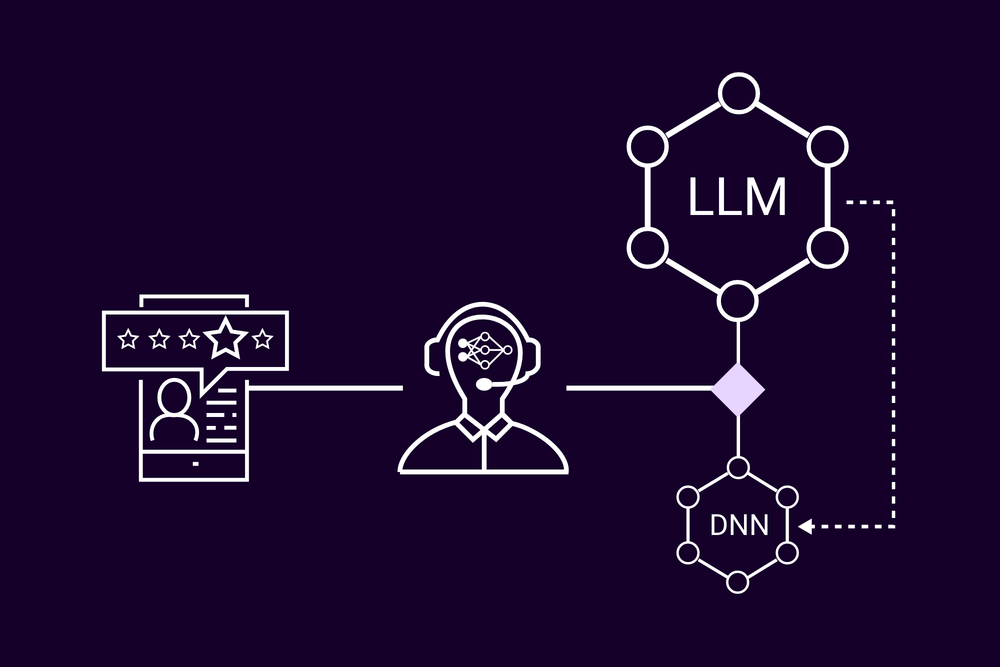

# An Efficient Agentic Review Moderation System

An innovative content moderation solution that leverages the power of Large Language Models (LLMs) for accurate moderation with minimal development overhead. This system integrates seamlessly with Modlee's deep learning autopilot to automatically scale moderation of product reviews while preserving the accuracy of LLMs.


---

## Table of Contents
- Introduction
- Features
- Getting Started
- Project Structure
- Usage
- Configuration
- Contributing
- License

---

## Introduction


<p align="center">
  
</p>


**Why LLM Based Agentic AI is Exciting**:

- **Rapid Prototyping**: Enables quicker and cheaper development of functional proofs of concept (POCs), allowing teams to validate ideas with minimal upfront investment.  
- **Adaptability**: Combines the flexibility of LLMs with the efficiency of task-specific distilled models to solve complex problems across various domains.

**Challenges in Scaling**

- **Cost**: Leveraging Large Language Models (LLMs) for high-volume applications can be prohibitively expensive, making sustained use at scale a significant financial challenge. The cost of running LLMs escalates with usage, particularly in scenarios requiring constant, real-time interactions.

- **Speed**: While LLMs deliver high-quality responses, their inference time can become a bottleneck in high-throughput, real-time systems. For example, a single inference call to ChatGPT 3.5 Turbo takes approximately 0.5 seconds, comparable to the inference time of a smaller Deep Neural Network (DNN) performing a similar task on a MacBook Air CPU. Leveraging a GPU and performing batch inference with the smaller DNN could dramatically accelerate inference.

    A more systematic approach to comparing these two solutions is by examining their parameter counts. GPT-3.5 Turbo, a proprietary model developed by OpenAI, has not disclosed its exact parameter count but is widely believed to be comparable to GPT-3, which contains 175 billion parameters. In contrast, the smaller DNN model discussed here utilizes TinyBERT for text embeddings, which has just 14 million parameters. This makes the smaller DNN approximately 10,000 times smaller than the LLM, highlighting the significant trade-offs between model complexity, resource requirements, and scalability.


**Opportunities with Distillation**:
- **Accuracy**: For only ~100 LLM labeled datapoints, the current DNN in `distilling_agentic_moderation.py` yields ~75% validation accuracy, at the time of writing this. This accuracy is expected to get better as the Modlee community grows. This means that 7.5 times out of 10 it produces the same decision as the LLM (GPT 3.5). This model is not optimized, even with the limited about of data.

- **Automation**: Our DNN Recommendation technology puts custom DNN development for a dataset on autopilot, so as your LLM labels more data you can automatically replace it.

    This system addresses these challenges by utilizing distilled deep learning models for cost-effective and fast inference, while retaining LLMs as a reliable fallback for edge cases. 

---

## Features

- **Dual Moderation System**: Combines the strengths of LLMs and deep neural network (DNN) models for efficient and accurate content moderation.  
- **Agentic LLM Solution**: Quickly deploy your moderation system with an LLM-based agent for immediate functionality.  
- **JSON Logging**: Captures moderation decisions, inputs, and outputs in JSON format, enabling full traceability and serving as training data for DNN models.  
- **Distilled DNN Solution**: Leverage Modlee's deep learning autopilot (experiment documentation & model recommendation) to seamlessly distill your LLM-based agent into a task-specific DNN model. Run this pipeline as often as needed to update your model with the latest insights from the Modlee community.  
- **Distilled Accuracy Tracking**: Automatically tracks the best-performing distilled model's accuracy and logs validation metrics in a structured details JSON file.  
- **Dynamic Thresholding**: Ensures high-quality moderation by dynamically deciding between LLM and DNN models based on predefined accuracy thresholds.  


---

## Getting Started

### Prerequisites

- Python >= 3.8  
- Required Python packages (see requirements.txt):  
  - modlee
  - langchain
  - openai
  - torch  
  - transformers  
  - scikit-learn  

### Installation

Clone the repository:  

    git clone https://github.com/yourusername/your-repo-name.git  
    cd your-repo-name  

Create a virtual environment and activate it:  

    python3 -m venv venv  
    source venv/bin/activate  # On Windows: venv\Scripts\activate  

Install the dependencies:  

    pip install -r requirements.txt  

[Sign Up](https://docs.modlee.ai/README.html#:~:text=%EF%83%81-,Sign%20up,-for%20a%20Modlee) for a free Modlee account. Navigate to the dashboard and generate an API key. Save your API key to an environment variable on your local machine

    export MODLEE_API_KEY="my-api-key"

so you can import it via `os.getenv("MODLEE_API_KEY")` later.

---

## Project Structure

    .
    ├── README.md                               # Comprehensive project documentation
    ├── requirements.txt                        # List of required Python dependencies
    ├── agentic_moderation.py                   # Core moderation script; switches between LLM and DNN for moderation tasks
    ├── distilling_agentic_moderation.py        # Automated pipeline for distilling LLM-based agents into task-specific DNNs
    ├── distilling_agentic_moderation_R&D.py    # Experimental script for manual distillation and research
    ├── moderation_results/                     # Directory to store moderation decisions, trained models, and metadata
    └── .gitignore                              # Specifies files and folders to exclude from version control

---


## Usage

### Moderation Flow

1. **Run Moderation**: Use `agentic_moderation.py` to moderate reviews seamlessly. The script dynamically selects either the LLM-based agent or the distilled DNN model based on your configuration and accuracy thresholds.  

    Example:
    python agentic_moderation.py

    To maintain synchronization with the distillation process, create an instance of `ReviewModerationAgent` in any file located alongside `distilling_agentic_moderation.py` and `distilling_agentic_moderation_R&D.py`. This ensures that the moderation logic aligns seamlessly with the latest distilled models and configurations.

2. **Fallback Logic**: The `agentic_moderation.py` script automatically falls back to the LLM if the distilled model does not meet the predefined accuracy threshold.


### Training and Distilling a Model

1. **Automated Distillation**: Use `distilling_agentic_moderation.py` to autonomously train and distill your LLM-based agent into a DNN model. The script leverages Modlee's model recommendation technology to produce a task-specific distilled model.

   Example:
   python distilling_agentic_moderation.py

2. **Experimental Distillation**: For research or custom experimentation, use `distilling_agentic_moderation_R&D.py`. This script allows manual adjustments to DNN models and experimentation with distillation parameters.

   Example:
   python distilling_agentic_moderation_R&D.py

3. **Validation and Accuracy Checks**: After distillation, evaluate the distilled model's accuracy using the automated pipeline. The results will be saved in the `moderation_results/` directory, including the validation accuracy and model metadata.

4. **Replace Existing Model**: If the distilled model achieves higher accuracy than the existing one, the script automatically updates the model and its corresponding metadata in the `moderation_results/` directory.

---


## Configuration

The `ReviewModerationAgent` can be configured using the following inputs to customize the moderation process:

### Example Configuration

```
agent = ReviewModerationAgent(
    llm=llm,
    system_description="A moderation system designed to flag offensive or inappropriate product reviews.",
    task="Moderate product reviews",
    goal="Determine if a review is offensive",
    decision_options=["offensive", "appropriate"],
    allow_distilled_model=True,
    distilled_model_accuracy_threshold=70
)
```

In this example:
- The `llm` parameter specifies the LLM used for fallback moderation.
- `system_description`, `task` & `goal` can be customized to your needs
- `decision_options` can be set to your needs
- The `allow_distilled_model` is set to True, enabling the use of distilled models if available.
- The `distilled_model_accuracy_threshold` is set to 70, meaning the distilled model will only be used if its accuracy is 70% or higher.


Adjusting Decision Options For Example Use Cases:
- Sentiment Analysis: Labels like positive, negative, and neutral for understanding customer opinions.
- Moderation: Labels like offensive, appropriate, spam, and toxic for ensuring reviews adhere to guidelines.
- Feedback Categorization: Labels like constructive, detailed, and product defect for actionable insights.


### Example Performance

After obtaining a distilled model by running `distilling_agentic_moderation.py`, if its accuracy exceeds the `distilled_model_accuracy_threshold`, it will automatically replace your LLM pipeline.

Below, we demonstrate the performance of a distilled model trained on LLM-generated labels for the `datasets/moderation.yaml` dataset. Note that the known labels in `moderation.yaml` and the predicted labels of the distilled model are identical. At the time of writing, the distilled model achieved **75% accuracy compared to the LLM pipeline (GPT-3.5 Turbo)**. This means the distilled model produced the same prediction as GPT-3.5 Turbo in 7.5 out of 10 cases.

#### Simulation Output

```
simulating live moderation of review
Selected Review: The customer support team was rude and unhelpful. Never buying again!
Known Review Label: offensive
Note: agent using distilled model for moderation
Predicted Review Label: offensive
Agent Time Taken: 0.5051 seconds

simulating live moderation of review
Selected Review: I love this item! It’s exactly as described and exceeded my expectations.
Known Review Label: appropriate
Note: agent using distilled model for moderation
Predicted Review Label: appropriate
Agent Time Taken: 0.4747 seconds

simulating live moderation of review
Selected Review: Earn money fast with this amazing product! Visit earnmoneyquick.com now!
Known Review Label: spam
Note: agent using distilled model for moderation
Predicted Review Label: spam
Agent Time Taken: 0.5021 seconds

simulating live moderation of review
Selected Review: This product promotes hate speech and should not be allowed on this platform.
Known Review Label: toxic
Note: agent using distilled model for moderation
Predicted Review Label: toxic
Agent Time Taken: 0.4597 seconds
```

#### Steps to Recreate This Example

1) Run LLM-based Moderation: Execute the following command: `python agentic_moderation.py`

    The main() function is configured to use GPT-3.5 Turbo to predict labels for reviews in datasets/moderation.yaml. Results will be stored as JSON files in the moderation_results folder.

2) Distill LLM Predictions: Execute the following command: `python distilling_agentic_moderation.py`
    
    The main() function acts as a deep learning autopilot. It uses Modlee's experiment documentation and model recommendation technology to distill the LLM-generated labels in moderation_results into a tailored DNN. The trained model is saved automatically for reuse.

3) Use the Distilled Model: Execute the following command: `python agentic_moderation.py`

    The main() function will automatically use the distilled model if its accuracy surpasses the distilled_model_accuracy_threshold. Running this script should produce results similar to the example above.


---

## Contributing

1. Fork the repository.  
2. Create a feature branch:  

       git checkout -b feature-name  

3. Commit your changes:  

       git commit -m "Add feature description"  

4. Push to your branch:  

       git push origin feature-name  

5. Open a pull request.  

---

## License

This project is licensed under the MIT License. See the `LICENSE` file for details.  
